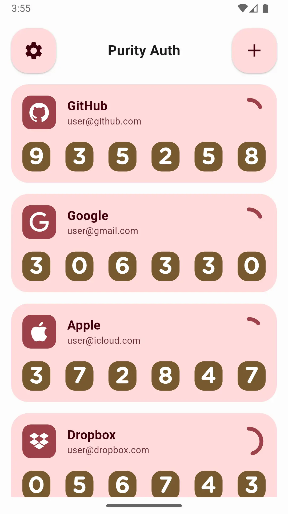
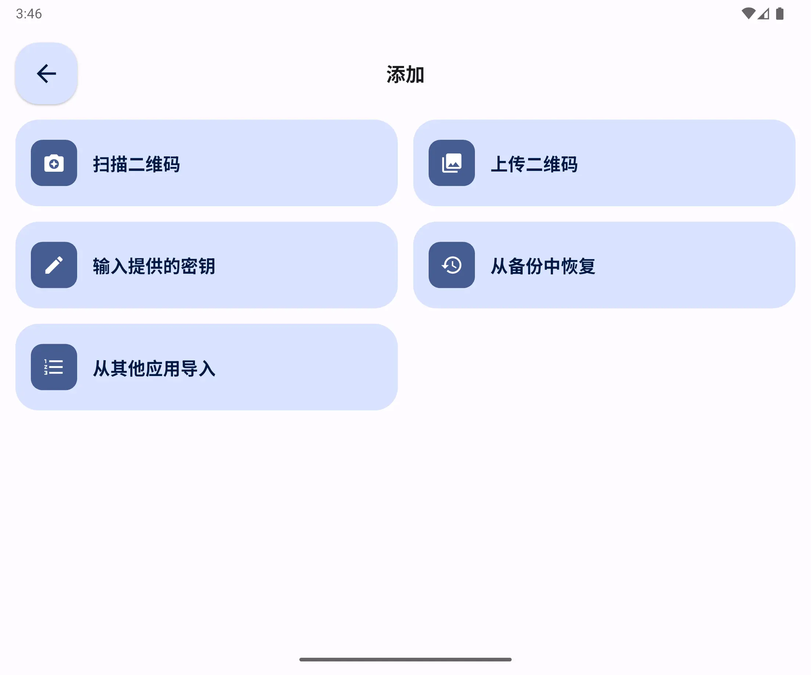
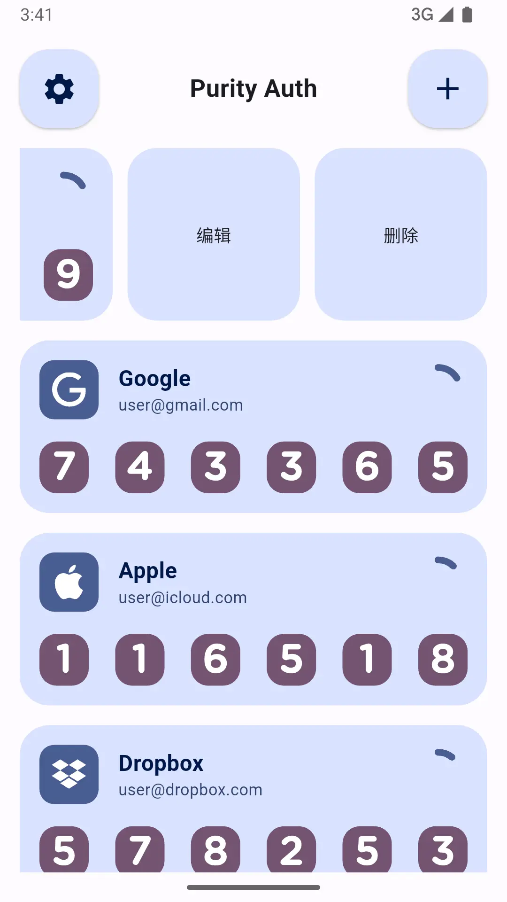
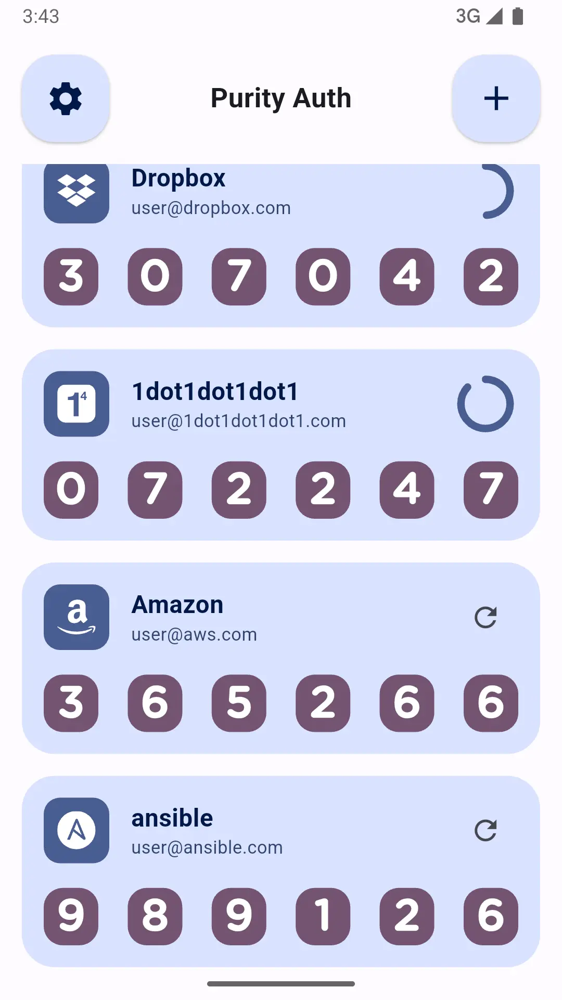
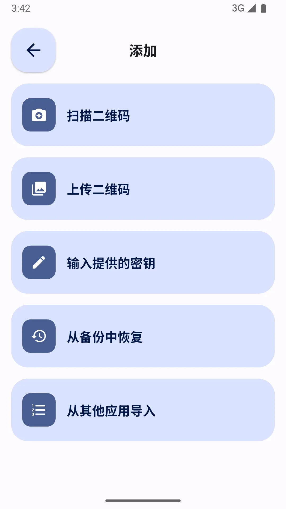
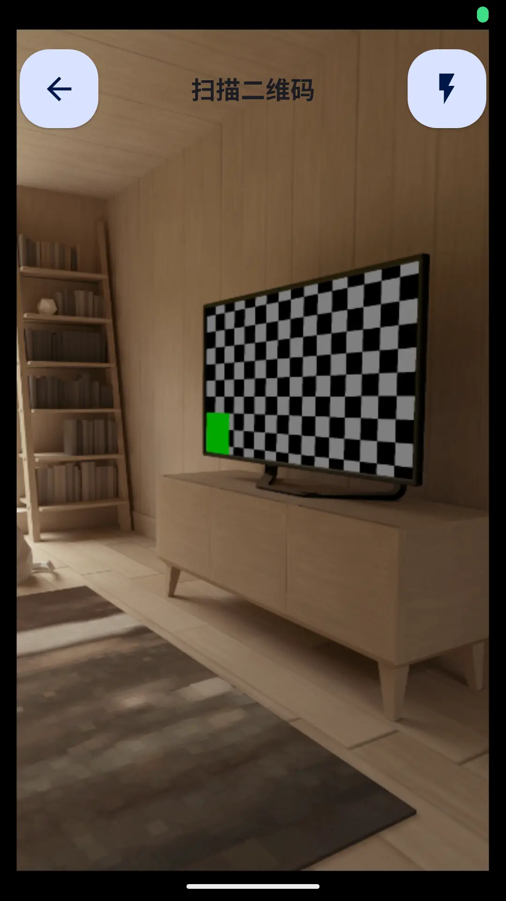
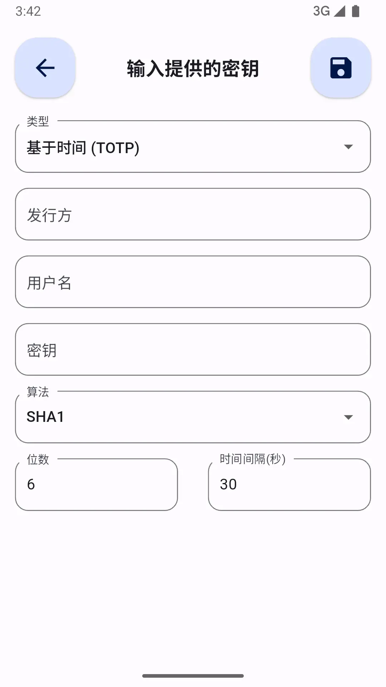
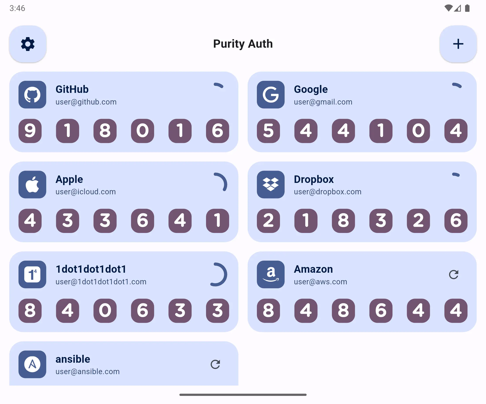

# Purity Auth

一款简洁、美观的全平台 2FA（双重身份验证）工具，致力于提供最简单易用的用户体验，帮助用户更安全地保护账户信息。完全离线运行，无非必要权限请求，确保您的隐私安全。

---

## ✨ 功能

- 🔒 提供简单的 2FA 生成与管理功能。
- 🎨 简洁美观的用户界面，易于操作。
- 🛑 完全离线，不依赖互联网连接。
- 🚫 无非必要的权限请求，尊重用户隐私。
- 📱 支持多平台（Windows、Mac、Linux、Android、iOS、Web）。

---

## 🎨 设计规范

### 1. **简洁性**
- 界面应保持简洁，避免过度装饰和冗余元素。
- 每个界面元素应有明确的功能和定位，减少不必要的干扰。

### 2. **一致性**
- 确保全局元素（如按钮、图标、颜色、字体等）在不同界面和状态下保持一致，增强用户的操作熟悉感和信任感。

### 3. **对比度**
- 确保文本与背景之间有足够的对比度，以提升可读性。
- 特别关注色弱用户，避免仅通过颜色传达信息，适当使用文字或图标辅助说明。

### 4. **颜色规范**
- 使用有限的主色调来构建界面，避免过多颜色干扰用户视线。
- 配合中性色调（如灰色、黑色、白色）来突出重要内容。
- 保证重要操作（如按钮、链接）与普通内容有足够的颜色对比。
- 使用动态色彩方案（如 Android 的动态色），以确保应用在不同系统主题下的兼容性与一致性。

### 5. **字体规范**
- 选择易读的字体，如系统默认字体（如 Roboto、San Francisco）或其他常见的 Web 字体。
- 使用适当的字号和行间距，确保文本的可读性。
- 标题、正文、按钮等文本应使用层次分明的字体大小，提升界面的可操作性和内容的层次感。

---

## 📸 截图

  

---

## 📥 安装

1. 从 [releases 页面](https://github.com/halifox/PurityAuth/releases) 下载适用于您平台的安装包。
2. 按照系统提示进行安装，无需联网即可使用。

---

## 🛠️ 使用方法

### 1. 添加账号并生成 2FA 密码
1. **打开应用**：启动后，您将看到主界面。点击页面上的 “添加账号” 按钮。
2. **扫描二维码或手动输入密钥**：
    - 如果您的服务提供商支持 QR 码扫描，点击“扫描二维码”按钮，使用手机或其他设备上的二维码扫描工具扫描屏幕上的二维码。
    - 如果您的服务提供商提供了手动输入密钥的选项，可以手动输入该密钥。
    - 应用会自动生成一个 6 位数的动态验证码。
3. **保存账户信息**：  
   输入完成后，点击 “保存” 按钮，将该账号信息保存至应用中。  
   您可以随时查看或删除已保存的账号。

   
### 2. 使用 2FA 密码进行身份验证
1. **登录您的账户**：在目标网站或应用中输入您的账号和密码。
2. **输入 2FA 密码**：
    - 当系统提示您输入 2FA 密码时，打开我们的 2FA 工具应用。
    - 在应用中找到您对应的账号名称，查看生成的 6 位动态验证码。
    - 输入该验证码，即可完成登录。
3. **过期时间**：每次生成的验证码仅在 30 秒内有效，请在有效时间内完成输入。⌛

### 3. 管理已保存的账号
1. **查看已保存的账号**：  
   在主界面上，所有已添加的账号将按名称列出。您可以轻松查找并查看每个账号的 2FA 密码。
2. **删除账号**：  
   侧滑账号条目后点击“删除”按钮，确认删除后，该账号将从应用中移除。  
   删除操作不可恢复，请谨慎操作。🗑️
3. **编辑账号**：  
   如果您需要修改某个账号的名称或重新扫描 QR 码，请侧滑账号条目后点击“编辑”按钮，进行修改。✏️

---

## ❓常见问题

Q1: 我丢失了设备，如何恢复 2FA？ 🤔  
A1: 如果您丢失了设备或无法访问已保存的 2FA 密码，您需要使用备份密钥或联系相关服务提供商进行账号恢复。请确保在启用 2FA 时保存了备份密钥。🔑  

Q2: 如何确保我的 2FA 密码安全？ 🔒  
A2: 由于该工具完全离线，不会向服务器发送任何信息，因此您的 2FA 密码仅存储在本地设备上。为提高安全性，建议您使用强密码锁定您的设备，并定期备份密钥。💼  

Q3: 我能在多个设备上使用此工具吗？ 📱💻  
A3: 目前该工具不支持同步功能，因此每个设备的 2FA 密码和账户信息仅在本地存储。如果需要在多个设备上使用，请分别在每个设备上进行设置。🔄 

Q4: 为什么我看到的验证码总是过期？ ⏳   
A4: 2FA 密码是基于时间的，每 30 秒更新一次。确保在验证码过期之前及时输入。如果验证码超时，请等待新验证码生成。⌛ 

---

## 🤝 贡献

我们欢迎任何形式的社区贡献！  
请阅读 [贡献指南 (CONTRIBUTING.md)](CONTRIBUTING.md)，了解如何提交 Issue、请求功能或贡献代码。

---

## 📜 许可证

本项目遵循 [GPL-3.0 License](LICENSE)。

---

## 🙏 致谢

- [daegalus/dart-otp](https://github.com/daegalus/dart-otp)
- [elliotwutingfeng/motp](https://github.com/elliotwutingfeng/motp)
- [stratumauth](https://github.com/stratumauth/app)
- [simple-icons](https://github.com/simple-icons/simple-icons)

## 📢 法律声明

本开源项目仅供个人技术学习与参考。由于可能涉及专利或版权相关内容，请在使用前确保已充分理解相关法律法规。未经授权，**请勿将本工具用于商业用途或进行任何形式的传播**。

本项目的所有代码和相关内容仅供个人技术学习与参考，任何使用产生的法律责任由使用者自行承担。

感谢您的理解与支持。
