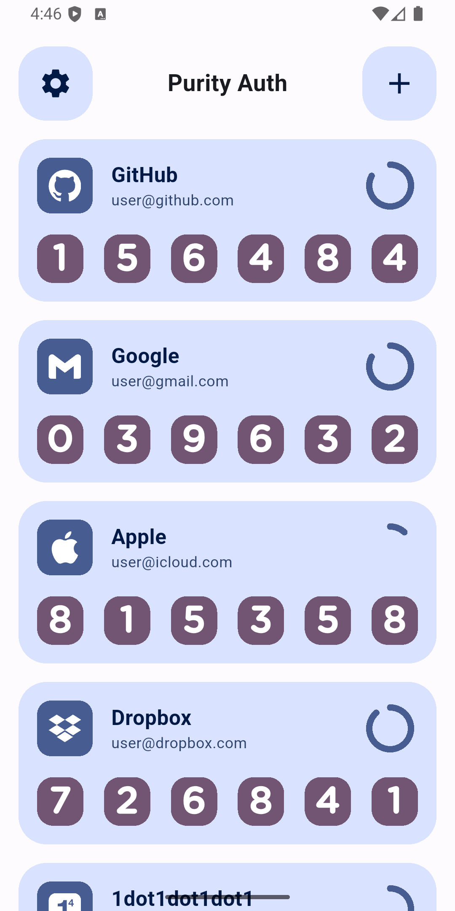
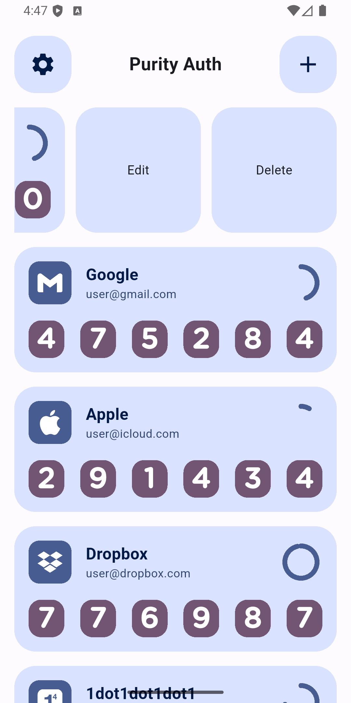
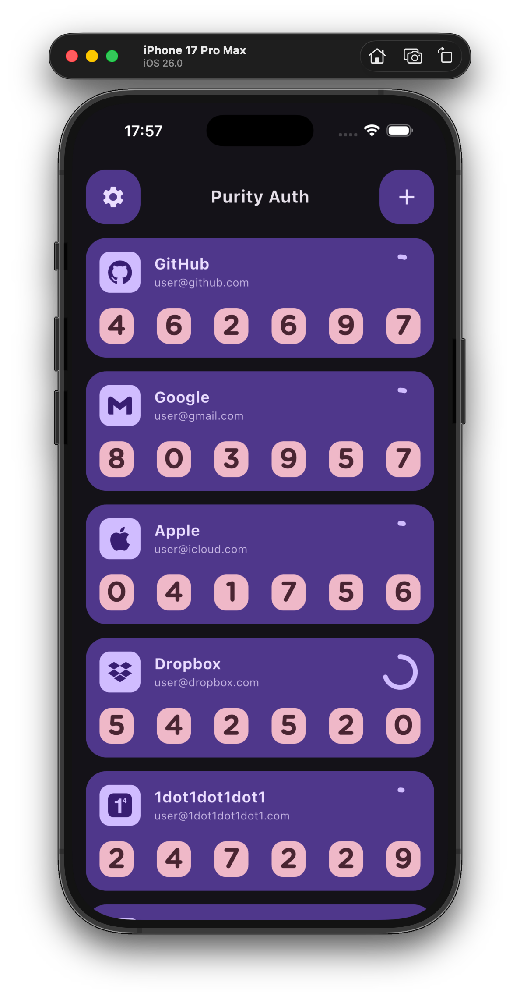

# Purity Auth

A clean, elegant cross-platform 2FA (Two-Factor Authentication) tool designed to provide the simplest and most user-friendly experience, helping users secure their account information more effectively. Runs completely offline with no unnecessary permission requests, ensuring your privacy and security.

---

## ✨ Features

- 🔒 Simple 2FA generation and management functionality.
- 🎨 Clean and elegant user interface that is easy to operate.
- 🛑 Completely offline operation with no internet dependency.
- 🚫 No unnecessary permission requests, respecting user privacy.
- 📱 Multi-platform support (Windows, Mac, Linux, Android, iOS, Web).

---

## 🎨 Design Guidelines

### 1. **Simplicity**

- The interface should remain clean and avoid excessive decoration and redundant elements.
- Each interface element should have a clear function and purpose, minimizing unnecessary distractions.

### 2. **Consistency**

- Ensure that global elements (such as buttons, icons, colors, fonts, etc.) remain consistent across different interfaces and states, enhancing user familiarity and trust.

### 3. **Contrast**

- Ensure sufficient contrast between text and background to improve readability.
- Pay special attention to color-blind users by avoiding information conveyance through color alone, and appropriately use text or icons for additional clarification.

### 4. **Color Standards**

- Use a limited primary color palette to build the interface, avoiding excessive colors that distract users.
- Complement with neutral tones (such as gray, black, white) to highlight important content.
- Ensure sufficient color contrast between important actions (such as buttons, links) and regular content.
- Use dynamic color schemes (such as Android's dynamic colors) to ensure compatibility and consistency across different system themes.

### 5. **Typography Standards**

- Choose readable fonts, such as system default fonts (like Roboto, San Francisco) or other common web fonts.
- Use appropriate font sizes and line spacing to ensure text readability.
- Text elements such as titles, body text, and buttons should use clearly hierarchical font sizes to enhance interface usability and content hierarchy.

---

## 📸 Screenshots

### Android

   
   
   
   

   
   
   
   

### Foldable Phone

   
   

### IOS

   
   
   
   

   
   
   

### MacOS

   
   

### Web

   

---

## 📥 Download and Installation Instructions

> ⚠️ Security Notice: The applications are not yet published on official app stores. Please download installation packages only from the official GitHub Releases page to ensure the authenticity of the software.  
> ⚠️ System Compatibility: Before installing, ensure that your device meets the minimum system requirements for the corresponding platform to avoid installation failures or runtime issues.

### Android
- The application is not available on Google Play.
- APK files can be downloaded from the [Releases page](https://github.com/halifox/PurityAuth/releases).
- Before installation, make sure your device allows installation from unknown sources and that the Android version meets the minimum requirement.

### iOS
- The application is not available on the App Store.
- Installation files are available on the [Releases page](https://github.com/halifox/PurityAuth/releases).
- Before installation, follow iOS prompts to trust the developer certificate and ensure the device version supports the application.

### macOS
- The application is not available on the Mac App Store.
- DMG or ZIP files can be downloaded from the [Releases page](https://github.com/halifox/PurityAuth/releases).
- During installation, you may need to allow “apps from any source” in system security settings.

### Windows
- The application is not available on Microsoft Store.
- Installation packages can be downloaded from the [Releases page](https://github.com/halifox/PurityAuth/releases).
- Ensure the system meets the minimum Windows version requirement and that you have administrator privileges to complete the installation.

### Linux
- The application is not available in any official software repositories.
- Executable files or compressed packages are available on the [Releases page](https://github.com/halifox/PurityAuth/releases).
- Some distributions may require additional dependencies; please refer to your distribution’s installation guide.

### Web
- Access the official hosted page directly: [https://purityauth.pages.dev](https://purityauth.pages.dev)
- No installation is required, suitable for quick testing and usage.
- Using a modern browser is recommended to ensure compatibility and security.

## Updates and Version Information
- All updates are published via the [GitHub Releases page](https://github.com/halifox/PurityAuth/releases).
- Users can check the changelog for each release to learn about new features and fixes.

## Security and Usage Boundaries
- It is strongly recommended to obtain installation packages only from official sources to prevent malicious tampering.
- This application provides identity verification functionality only and does not guarantee security of the device or system in other aspects.
- For enterprise or managed environments, ensure compliance with relevant IT security policies before use.

---

## 🛠️ Usage Instructions

### 1. Adding Accounts and Generating 2FA Codes

1. **Launch the Application**: After startup, you will see the main interface. Click the "Add Account" button on the page.
2. **Scan QR Code or Manually Enter Secret Key**:
    - If your service provider supports QR code scanning, click the "Scan QR Code" button and use a QR code scanner on your phone or other device to scan the QR code displayed on the screen.
    - If your service provider offers a manual secret key input option, you can manually enter the secret key.
    - The application will automatically generate a 6-digit dynamic verification code.
3. **Save Account Information**:  
   After input is complete, click the "Save" button to save the account information to the application.  
   You can view or delete saved accounts at any time.

### 2. Using 2FA Codes for Authentication

1. **Log into Your Account**: Enter your username and password on the target website or application.
2. **Enter 2FA Code**:
    - When the system prompts you to enter a 2FA code, open our 2FA tool application.
    - Find the corresponding account name in the application and view the generated 6-digit dynamic verification code.
    - Enter this verification code to complete the login process.
3. **Expiration Time**: Each generated verification code is valid for only 30 seconds. Please complete the input within the valid time period.⌛

### 3. Managing Saved Accounts

1. **View Saved Accounts**:  
   On the main interface, all added accounts will be listed by name. You can easily find and view the 2FA codes for each account.
2. **Delete Accounts**:  
   Swipe the account entry and click the "Delete" button. After confirming deletion, the account will be removed from the application.  
   Deletion operations cannot be undone. Please proceed with caution.🗑️
3. **Edit Accounts**:  
   If you need to modify an account name or rescan a QR code, swipe the account entry and click the "Edit" button to make changes.✏️

---

## ❓ Frequently Asked Questions

Q1: I lost my device. How can I recover 2FA? 🤔  
A1: If you have lost your device or cannot access saved 2FA codes, you will need to use backup keys or contact the relevant service provider for account recovery. Please ensure you saved backup keys when enabling 2FA.🔑

Q2: How can I ensure my 2FA codes are secure? 🔒  
A2: Since this tool operates completely offline and does not send any information to servers, your 2FA codes are stored only on your local device. For enhanced security, we recommend using a strong password to lock your device and regularly backing up your keys.💼

Q3: Can I use this tool on multiple devices? 📱💻  
A3: Currently, this tool does not support synchronization functionality, so 2FA codes and account information are stored locally on each device. If you need to use it on multiple devices, please set it up separately on each device.🔄

Q4: Why do I always see expired verification codes? ⏳   
A4: 2FA codes are time-based and update every 30 seconds. Ensure you enter the code before it expires. If the code times out, please wait for a new code to be generated.⌛

---

## 🤝 Contributing

We welcome community contributions of any kind!  
Please read the [Contributing Guidelines (CONTRIBUTING.md)](CONTRIBUTING.md) to learn how to submit issues, request features, or contribute code.

---

## 📜 License

This project is licensed under the [GPL-3.0 License](LICENSE).

---

## 🙏 Acknowledgments

- [daegalus/dart-otp](https://github.com/daegalus/dart-otp)
- [elliotwutingfeng/motp](https://github.com/elliotwutingfeng/motp)
- [stratumauth](https://github.com/stratumauth/app)
- [simple-icons](https://github.com/simple-icons/simple-icons)
- [sembast](https://pub.dev/packages/sembast)
- [google_mlkit_barcode_scanning](https://pub.dev/packages/google_mlkit_barcode_scanning)
- [dynamic_color](https://pub.dev/packages/dynamic_color)
- [flutter_swipe_action_cell](https://pub.dev/packages/flutter_swipe_action_cell)
- [mobile_scanner](https://github.com/juliansteenbakker/mobile_scanner)

## 📢 Legal Notice

This open-source project is intended solely for personal technical learning and reference purposes. As it may involve patent or copyright-related content, please ensure you fully understand the relevant laws and regulations before use. Without authorization, **please do not use this tool for commercial purposes or distribute it in any form**.

All code and related content in this project are intended solely for personal technical learning and reference. Users are responsible for any legal consequences arising from their use of this project.

Thank you for your understanding and support.